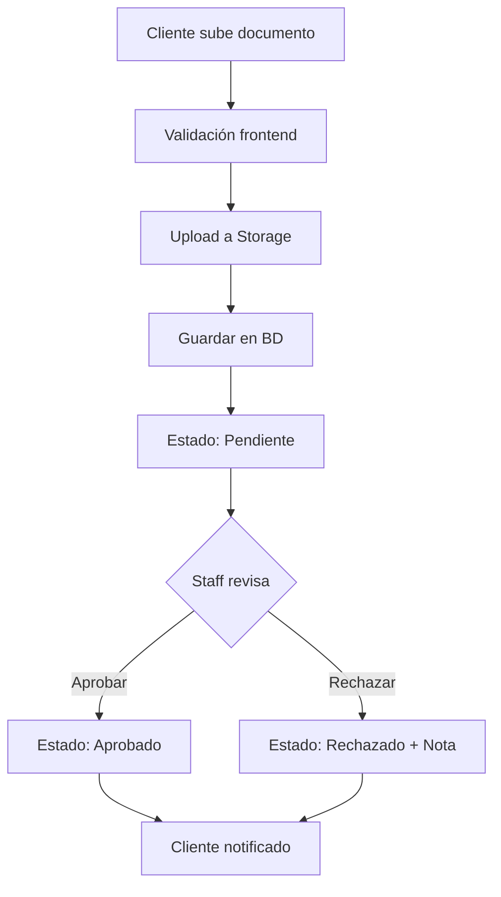

# 📄 Sistema de Documentos del Cliente en Reclamaciones

## ✅ Implementación Completa

### 🎯 Ubicación
Los clientes ahora pueden **subir documentos directamente en sus reclamaciones**, no como página separada.

**Ruta**: `/claims/[id]` → Tab "Documentos" → Sección "Documentos del Cliente"

---

## 🗄️ Configuración de Base de Datos

### 1. Ejecutar SQL en Supabase

Ve a **Supabase Dashboard** → **SQL Editor** y ejecuta el archivo:
```
claim_customer_documents_table.sql
```

Este script crea:
- ✅ Tabla `claim_customer_documents`
- ✅ Índices para performance
- ✅ RLS Policies (seguridad)
- ✅ Triggers para `updated_at`

---

## 🪣 Configuración de Storage

### 2. Verificar Bucket en Supabase

**Storage** → **Buckets** → Verificar que existe: `clientes-adjuntos`

**Configuraciones del bucket**:
- **Nombre**: `clientes-adjuntos`
- **Público**: ✅ Sí (para URLs públicas)
- **File size limit**: 10MB
- **Allowed MIME types**: 
  - `image/jpeg`
  - `image/png`
  - `application/pdf`

#### Políticas de Storage (RLS)

Ve a **Storage** → `clientes-adjuntos` → **Policies** y crea:

**1. Policy: Customers can upload**
```sql
CREATE POLICY "Customers can upload to their claims folder"
ON storage.objects FOR INSERT
WITH CHECK (
  bucket_id = 'clientes-adjuntos' 
  AND auth.role() = 'authenticated'
);
```

**2. Policy: Anyone can view**
```sql
CREATE POLICY "Anyone can view uploaded files"
ON storage.objects FOR SELECT
USING (bucket_id = 'clientes-adjuntos');
```

**3. Policy: Customers can delete their pending files**
```sql
CREATE POLICY "Customers can delete their own files"
ON storage.objects FOR DELETE
USING (
  bucket_id = 'clientes-adjuntos'
  AND auth.role() = 'authenticated'
);
```

---

## 🎨 Características Implementadas

### Para Clientes (Customer)
- ✅ **Subir documentos** (PDF, JPG, PNG - máx 10MB)
- ✅ **Ver sus documentos** con estado (Pendiente/Aprobado/Rechazado)
- ✅ **Descargar documentos**
- ✅ **Eliminar documentos pendientes**
- ✅ **Vista previa** (abrir en nueva pestaña)

### Para Staff (Admin/Agent/Adjuster)
- ✅ **Subir documentos** en nombre del cliente (PDF, JPG, PNG - máx 10MB)
- ✅ **Ver todos los documentos** del cliente
- ✅ **Aprobar documentos** ✓
- ✅ **Rechazar documentos** ✗ (con nota opcional)
- ✅ **Descargar documentos**
- ✅ **Vista previa**

---

## 📋 Tipos de Documentos Soportados

El sistema detecta automáticamente el tipo basado en el nombre del archivo:

| Tipo | Detección Automática | Etiqueta |
|------|---------------------|----------|
| `license` | "licencia", "license" | Licencia de Conducir |
| `id` | "identificacion", "id", "ine" | Identificación Oficial |
| `proof_of_address` | "comprobante", "domicilio" | Comprobante de Domicilio |
| `invoice` | "factura", "invoice" | Factura del Vehículo |
| `police_report` | "policia", "police" | Reporte Policial |
| `photos` | "foto", "photo", "img" | Fotografías del Siniestro |
| `other` | (default) | Otro Documento |

---

## 🔐 Seguridad Implementada

### RLS Policies (Base de Datos)
- ✅ Clientes solo ven sus propios documentos
- ✅ Clientes solo pueden subir a sus reclamaciones
- ✅ **Staff (Admin/Agent/Adjuster) pueden subir documentos a cualquier reclamación**
- ✅ Clientes solo pueden eliminar documentos pendientes
- ✅ Staff puede ver/actualizar todos los documentos

### Validaciones (Frontend)
- ✅ Tamaño máximo: 10MB
- ✅ Tipos permitidos: PDF, JPG, PNG
- ✅ Validación de permisos por rol

---

## 🚀 Cómo Usar

### Como Cliente:

1. **Ir a una reclamación**
   - Navegar a "Mis Reclamaciones"
   - Seleccionar una reclamación

2. **Subir documento**
   - Ir al tab "Documentos"
   - Clic en "Subir Documento"
   - Seleccionar archivo (PDF/JPG/PNG, máx 10MB)
   - El archivo se sube automáticamente

3. **Gestionar documentos**
   - Ver estado: Pendiente/Aprobado/Rechazado
   - Descargar con ícono 👁️
   - Eliminar (solo pendientes) con ícono 🗑️

### Como Staff (Agent/Adjuster/Admin):

1. **Ver documentos del cliente**
   - Abrir cualquier reclamación
   - Ir al tab "Documentos"
   - Ver sección "Documentos del Cliente"

2. **Subir documentos en nombre del cliente**
   - Clic en "Subir Documento"
   - Seleccionar archivo (PDF/JPG/PNG, máx 10MB)
   - El archivo se asocia automáticamente al cliente de la reclamación

3. **Aprobar/Rechazar**
   - Clic en ✓ para aprobar
   - Clic en ✗ para rechazar (con nota opcional)

---

## 🎨 Modo Oscuro

✅ **Totalmente compatible** con dark mode
- Cards, badges, borders adaptados
- Colores optimizados para ambos modos

---

## 📁 Estructura de Archivos en Storage

```
clientes-adjuntos/
  └── {claim_id}/
      ├── 1699123456789-abc123.pdf
      ├── 1699123457890-def456.jpg
      └── 1699123458901-ghi789.png
```

Organización por carpeta de reclamación para mejor gestión.

---

## 🔄 Flujo de Trabajo



---

## ✅ Checklist de Implementación

- [x] Crear tabla `claim_customer_documents`
- [x] Configurar RLS policies en BD
- [x] Verificar bucket `clientes-adjuntos`
- [x] Configurar policies de Storage
- [x] Componente `ClaimCustomerDocuments`
- [x] Integrar en página de reclamaciones
- [x] Remover navegación "Mis Documentos"
- [x] Soporte dark mode
- [x] Validaciones de seguridad

---

## 🧪 Testing

### Probar como Cliente:
1. Login como cliente
2. Ir a "Mis Reclamaciones"
3. Abrir una reclamación existente
4. Tab "Documentos"
5. Subir un PDF de prueba
6. Verificar que aparece en la lista
7. Probar descargar y eliminar

### Probar como Staff:
1. Login como agent/adjuster/admin
2. Abrir la misma reclamación
3. Ver el documento subido por el cliente
4. Probar aprobar/rechazar
5. Verificar que el cliente ve el cambio de estado

---

## 📊 Monitoreo

### Ver archivos en Storage:
**Supabase Dashboard** → **Storage** → `clientes-adjuntos`

### Ver registros en BD:
```sql
SELECT 
  ccd.*,
  c.claim_number,
  cu.first_name,
  cu.last_name
FROM claim_customer_documents ccd
JOIN claims c ON c.id = ccd.claim_id
JOIN customers cust ON cust.id = ccd.customer_id
JOIN users cu ON cu.id = cust.user_id
ORDER BY ccd.upload_date DESC;
```

---

## 🐛 Troubleshooting

### "Error al subir documento"
- Verificar que el bucket existe
- Verificar policies de Storage
- Verificar tamaño del archivo (< 10MB)

### "No se muestran los documentos"
- Verificar RLS policies en tabla
- Verificar que `claim_id` y `customer_id` son correctos
- Revisar consola del navegador

### "No puedo eliminar documento"
- Solo se pueden eliminar documentos con estado `pending`
- Verificar que eres el propietario (customer)

---

## 📝 Notas Finales

- ✅ Los documentos se organizan por `claim_id` en Storage
- ✅ URLs públicas para fácil acceso
- ✅ Detección automática de tipo de documento
- ✅ Sistema completamente funcional para producción
