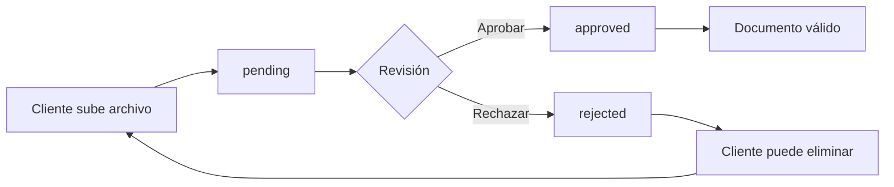

# Sistema de Documentos de Cliente - SeguraTuAuto

## 📋 Descripción General

Sistema completo para que los clientes puedan subir, gestionar y rastrear sus documentos (licencia, identificación, comprobantes, etc.) con revisión y aprobación por parte de agentes/administradores.

---

## 🗄️ Base de Datos

### Tabla: `customer_documents`

```sql
CREATE TABLE customer_documents (
  id UUID PRIMARY KEY,
  customer_id UUID REFERENCES customers(id),
  document_type VARCHAR(50), -- 'license', 'id', 'proof_of_address', 'invoice', 'other'
  file_name VARCHAR(255),
  file_url TEXT,
  file_size INTEGER,
  mime_type VARCHAR(100),
  upload_date TIMESTAMP,
  status VARCHAR(20), -- 'pending', 'approved', 'rejected'
  notes TEXT,
  claim_id UUID REFERENCES claims(id),
  reviewed_by UUID REFERENCES users(id),
  reviewed_at TIMESTAMP,
  created_at TIMESTAMP,
  updated_at TIMESTAMP
);
```

### Políticas RLS Implementadas

#### Clientes (`customer`)
- ✅ **SELECT**: Solo pueden ver sus propios documentos
- ✅ **INSERT**: Solo pueden crear documentos asociados a su cuenta
- ✅ **UPDATE**: Solo documentos en estado `pending`
- ✅ **DELETE**: Solo documentos en estado `pending`

#### Agentes/Admins (`agent`, `admin`)
- ✅ **SELECT**: Pueden ver todos los documentos
- ✅ **UPDATE**: Pueden actualizar cualquier documento (aprobar/rechazar)

---

## ☁️ Almacenamiento Supabase

### Bucket: `clientes-adjuntos`

**Configuración:**
- **Endpoint**: `https://sztuxibgvlwbykaopnqg.storage.supabase.co/storage/v1/s3`
- **Región**: `us-east-2`
- **Acceso**: Privado con RLS
- **Tamaño máximo por archivo**: 10 MB
- **Tipos permitidos**: `image/jpeg`, `image/png`, `application/pdf`

**Estructura de carpetas:**
```
clientes-adjuntos/
├── {customer_id}/
│   ├── license/
│   │   └── {filename}
│   ├── id/
│   │   └── {filename}
│   ├── proof_of_address/
│   │   └── {filename}
│   ├── invoice/
│   │   └── {filename}
│   └── other/
│       └── {filename}
```

---

## 🎨 Interfaz de Usuario

### Página: `/customer/documents`

**Componente**: `app/customer/documents/page.tsx`

#### Características:
1. **Vista de Documentos**
   - Lista de documentos subidos
   - Filtrado por tipo y estado
   - Vista previa de imágenes
   - Descarga de archivos

2. **Subida de Archivos**
   - Drag & drop o selector de archivos
   - Validación de tipo y tamaño
   - Barra de progreso
   - Detección automática de tipo de documento

3. **Estados de Documentos**
   - 🕒 **Pendiente** (`pending`): Subido, esperando revisión
   - ✅ **Aprobado** (`approved`): Revisado y aprobado
   - ❌ **Rechazado** (`rejected`): Rechazado con notas

4. **Acciones Disponibles**
   - 👁️ Ver/Previsualizar documento
   - ⬇️ Descargar archivo
   - 🗑️ Eliminar (solo si está pendiente)

---

## 🔧 Tipos TypeScript

### Interface: `CustomerDocument`

```typescript
export interface CustomerDocument {
  id: string;
  customer_id: string;
  document_type: 'license' | 'id' | 'proof_of_address' | 'invoice' | 'other';
  file_name: string;
  file_url: string;
  file_size: number;
  mime_type?: string;
  upload_date: string;
  status: 'pending' | 'approved' | 'rejected';
  notes?: string;
  claim_id?: string;
  reviewed_by?: string;
  reviewed_at?: string;
  created_at: string;
  updated_at: string;
  customer?: Customer;
  claim?: Claim;
  reviewer?: User;
}
```

**Ubicación**: `lib/types/database.ts`

---

## 🚀 Funcionalidades Implementadas

### 1. Subida de Archivos

```typescript
const handleFileUpload = async (file: File, type: string) => {
  // 1. Validación
  if (!validateFile(file)) return;

  // 2. Subir a Storage
  const filePath = `${customerId}/${type}/${file.name}`;
  await supabase.storage
    .from('clientes-adjuntos')
    .upload(filePath, file);

  // 3. Obtener URL pública
  const { data: { publicUrl } } = supabase.storage
    .from('clientes-adjuntos')
    .getPublicUrl(filePath);

  // 4. Guardar registro en BD
  await supabase
    .from('customer_documents')
    .insert({
      customer_id: customerId,
      document_type: type,
      file_name: file.name,
      file_url: publicUrl,
      file_size: file.size,
      mime_type: file.type,
      status: 'pending',
    });
};
```

### 2. Visualización de Documentos

```typescript
const fetchDocuments = async () => {
  const { data } = await supabase
    .from('customer_documents')
    .select('*')
    .eq('customer_id', customerId)
    .order('upload_date', { ascending: false });

  setDocuments(data || []);
};
```

### 3. Eliminación de Documentos

```typescript
const handleDeleteDocument = async (doc: CustomerDocument) => {
  // 1. Eliminar archivo de Storage
  const filePath = doc.file_url.split('/').slice(-3).join('/');
  await supabase.storage
    .from('clientes-adjuntos')
    .remove([filePath]);

  // 2. Eliminar registro de BD
  await supabase
    .from('customer_documents')
    .delete()
    .eq('id', doc.id);
};
```

---

## 🎯 Navegación

### Sidebar de Cliente

Ubicación en navegación:
```
Dashboard
Mis Pólizas
Mis Reclamaciones
---
Mis Vehículos
Evaluación de Riesgo
📄 Mis Documentos ← NUEVO
```

**Configuración**: `components/navigation/role-specific-sidebars.tsx`

---

## 📝 Validaciones Implementadas

### Validación de Archivos

```typescript
const validateFile = (file: File): boolean => {
  // Tamaño máximo: 10MB
  const MAX_SIZE = 10 * 1024 * 1024;
  if (file.size > MAX_SIZE) {
    alert('El archivo excede el tamaño máximo de 10MB');
    return false;
  }

  // Tipos permitidos
  const ALLOWED_TYPES = [
    'image/jpeg',
    'image/png',
    'application/pdf',
  ];
  if (!ALLOWED_TYPES.includes(file.type)) {
    alert('Tipo de archivo no permitido. Use JPG, PNG o PDF.');
    return false;
  }

  return true;
};
```

### Detección Automática de Tipo

```typescript
const detectDocumentType = (fileName: string): string => {
  const lower = fileName.toLowerCase();
  
  if (lower.includes('licencia') || lower.includes('license')) {
    return 'license';
  }
  if (lower.includes('identidad') || lower.includes('cedula') || lower.includes('id')) {
    return 'id';
  }
  if (lower.includes('domicilio') || lower.includes('address')) {
    return 'proof_of_address';
  }
  if (lower.includes('factura') || lower.includes('invoice')) {
    return 'invoice';
  }
  
  return 'other';
};
```

---

## 🔐 Seguridad

### 1. Autenticación
- ✅ Verificación de sesión activa
- ✅ Validación de rol de usuario

### 2. Autorización (RLS)
- ✅ Clientes solo ven sus documentos
- ✅ No pueden modificar documentos aprobados/rechazados
- ✅ Agentes/admins pueden ver y actualizar todos

### 3. Validación de Archivos
- ✅ Tipos MIME verificados
- ✅ Tamaño limitado a 10MB
- ✅ Nombres de archivo sanitizados

### 4. Storage Privado
- ✅ URLs firmadas para acceso temporal
- ✅ No hay acceso público directo

---

## 📊 Estados del Workflow



---

## 🛠️ Próximas Mejoras (Opcionales)

1. **Notificaciones**
   - Alertar al cliente cuando un documento es aprobado/rechazado
   - Recordatorios de documentos pendientes

2. **OCR/Validación Automática**
   - Extraer datos de licencias/IDs
   - Validar fechas de expiración

3. **Asociación con Reclamaciones**
   - Permitir subir documentos específicos para un claim
   - Campo `claim_id` ya implementado

4. **Versionado de Documentos**
   - Mantener historial de versiones
   - Comparación de cambios

5. **Firma Electrónica**
   - Documentos que requieren firma del cliente
   - Integración con servicios de firma digital

---

## 📦 Archivos Creados/Modificados

### Nuevos
- ✅ `app/customer/documents/page.tsx` - Página de gestión de documentos
- ✅ `customer_documents_table.sql` - Schema de base de datos
- ✅ `docs/CUSTOMER_DOCUMENTS_SYSTEM.md` - Esta documentación

### Modificados
- ✅ `lib/types/database.ts` - Agregada interface `CustomerDocument`
- ✅ `components/navigation/role-specific-sidebars.tsx` - Agregado item "Mis Documentos"

---

## ✅ Checklist de Implementación

- [x] Crear tabla `customer_documents` en Supabase
- [x] Configurar bucket `clientes-adjuntos` en Storage
- [x] Implementar políticas RLS
- [x] Crear interface TypeScript
- [x] Desarrollar página de gestión `/customer/documents`
- [x] Agregar navegación en sidebar
- [x] Validación de archivos (tipo y tamaño)
- [x] Subida a Storage con estructura de carpetas
- [x] Descarga de archivos
- [x] Eliminación con validación de estado
- [ ] **PENDIENTE**: Ejecutar `customer_documents_table.sql` en Supabase
- [ ] **PENDIENTE**: Probar subida de archivos
- [ ] **PENDIENTE**: Verificar políticas RLS

---

## 🎯 Instrucciones para Deployment

### 1. Ejecutar SQL en Supabase
```bash
# En Supabase Dashboard > SQL Editor
# Ejecutar el contenido de: customer_documents_table.sql
```

### 2. Verificar Bucket
```bash
# En Supabase Dashboard > Storage
# Confirmar que existe: clientes-adjuntos
# Verificar configuración de acceso privado
```

### 3. Probar Funcionalidad
1. Login como cliente
2. Ir a "Mis Documentos"
3. Subir un archivo de prueba
4. Verificar que aparece en lista
5. Intentar eliminar (solo si está pending)

---

## 📞 Soporte

Para cualquier problema o duda sobre el sistema de documentos:
- Revisar logs en consola del navegador
- Verificar políticas RLS en Supabase
- Confirmar que el bucket tiene acceso configurado

---

**Stack**: Next.js 14 | TypeScript | Supabase (PostgreSQL + Storage) | shadcn/ui | Tailwind CSS
